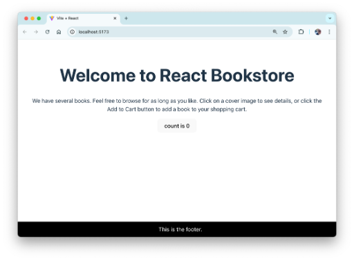

# Lab 02: Your First Component

React com5. Start the app (if it's not already running) and view it in your browser.

ents let you divide your user interface into independent and reusable pieces. The simplest components simply output some piece of HTML, given some input. All that’s required is a simple JavaScript function.

In this lab, you’ll create a functional component to hold the contents of the page footer.

1. Create a new file named **Footer.jsx** in the **src** directory.

2. Type the code below into **Footer.jsx**:

```javascript
function Footer() {
  const footerStyle = {
    backgroundColor: 'black',
    color: 'white',
    padding: '10px',
    position: 'fixed',
    left: '0',
    bottom: '0',
    margin: '0',
    width: '100%',
  };

  return <p style={footerStyle}>This is the footer.</p>;
}

export default Footer;
```

3. Add the following to the beginning of **App.jsx**:

```javascript
import Footer from './Footer.jsx';
```

4. Add the following inside **App.jsx** (before `</>`):

```javascript
<Footer />
```

5. Start the app (if it’s not already running) and view it in your browser.


