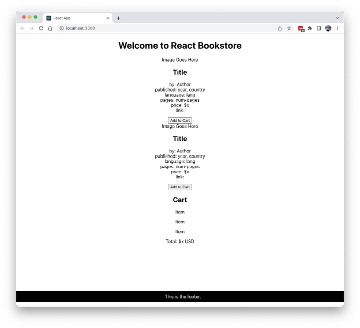

# Lab 04: Static Version

The first step in creating a React UI is to create a static version. In this lab, you’ll start with a mockup of the react-bookstore application, and you’ll create components to make a mockup of the catalog.

1. Open **professional-reactjs/starter/lab04/**.

   You’ll see three folders: **data**, **images**, and **mockup**.

2. Open **data/products.json** in your code editor.

   This is a file in JavaScript Object Notation (JSON) containing 100 great books. We’ll be building a store using this data.

3. Open **starter/lab04/mockup** and look at the **mockup.png** image.

   This image shows what the final store and shopping cart should look like.

4. Figure out how you might divide the user interface shown in **mockup.png** into a hierarchy of components. Make a quick drawing on paper, or in MS Paint, or however you like. Check out **mockup-components.png** if you want to see one way it can be done.

   **Hint 1:** If two components need to access the same piece of data, they should have a common parent that holds this data.

   **Hint 2:** Look for repeating elements that can be made into components.

5. Move the **data** directory from the **/starter/lab04** directory into the **src** directory inside your **react-bookstore** project.

6. Move the **images** directory into the **public** directory.

7. Open the **App.jsx** component in your project and modify it to the following.

   **NOTE:** Some of the components referenced in this code don’t exist yet. You’ll be creating them in the next step.

   ```javascript
   import Header from './Header.jsx';
   import ProductList from './ProductList.jsx';
   import Cart from './Cart.jsx';
   import Footer from './Footer.jsx';
   import './App.css';

   function App() {
     return (
       <>
         <Header />
         <ProductList />
         <Cart />
         <Footer />
       </>
     );
   }

   export default App;
   ```

8. Create basic components for ProductList and Cart and their sub-components. Don’t worry about styling them, but try to make each one contain the basic information (without images at this point) as in the mockup.

9. Create basic tests for each of the new components, using the same structure you used in the previous lab.

10. Run `npm run dev` to verify that your code builds. Your UI should now look something like this:


