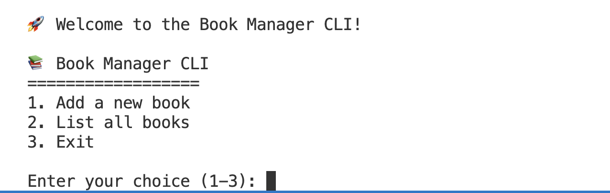

# Lab 05: DOM Manipulation and Modern JavaScript

## PART I. Working with an API

In this first part, you’ll write a JavaScript application to make a call to NASA's API to get data on the near-Earth asteroids based on their closest approach date to Earth. All the data is from the NASA JPL Asteroid team (<http://neo.jpl.nasa.gov/>). We are looking for data regarding the asteroids' distance from the Earth, speed, size, and whether each asteroid is potentially hazardous.

1. In your code editor, create a new folder (outside of your other project folder) named `asteroids`.

2. Create a new file in the `asteroids` folder and name it `asteroids.js`.

3. Open `asteroids.js` and create a variable called `today` and set it to a string containing the current date.

   ```javascript
   const today = new Date().toISOString().slice(0, 10);
   ```

4. Navigate to <https://api.nasa.gov/index.html#apply-for-an-api-key>.

5. Enter your information and check your email for the API key. Congratulations, you have a developer's API key from NASA!

6. Create a variable called `key` and set it equal to the API key from NASA.

   ```javascript
   const key = 'your-very-own-and-very-long-key';
   ```

7. Create the variable called `url`.

   ```javascript
   const url = `https://api.nasa.gov/neo/rest/v1/feed?start_date=${today}&api_key=${key}`;
   ```

8. Create a new class named `Asteroid`, and give it a constructor.

   ```javascript
   class Asteroid {
     constructor(isHazardous, distance, speed, size) {
       this.isHazardous = isHazardous;
       this.distance = distance;
       this.speed = speed;
       this.size = size;
     }

     static async getAsteroids() {
       try {
         const response = await fetch(url);
         if (!response.ok) {
           throw new Error('Network response was not ok');
         }
         const data = await response.json();
         console.log(data);
       } catch (error) {
         console.log(error);
       }
     }
   }
   ```

9. Test your `getAsteroids` method by calling it in the browser console:

   ```javascript
   Asteroid.getAsteroids();
   ```

   You should see the asteroid data returned from NASA's API:

   

10. Continue building the application by parsing the JSON data and creating instances of the `Asteroid` class for each object in the response.
