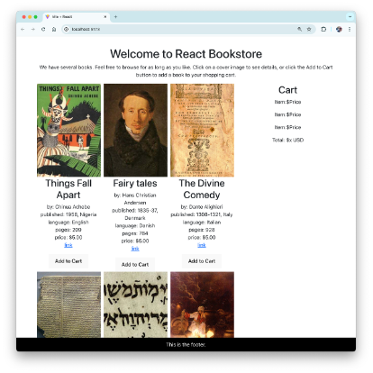

# Lab 07: Props and Containers

In this lab, you’ll learn how to use props to pass data between components and how to create container components.

1. Open your React project in your code editor.

2. Create a new component named `Book.jsx` in the `src` directory:

```javascript
function Book({ title, author }) {
  return (
    <div>
      <h2>{title}</h2>
      <p>by {author}</p>
    </div>
  );
}

export default Book;
```

3. Create a new component named `BookList.jsx` in the `src` directory:

```javascript
import Book from './Book';

function BookList() {
  const books = [
    { title: 'React for Beginners', author: 'Chris Minnick' },
    { title: 'Advanced React', author: 'John Doe' },
  ];

  return (
    <div>
      {books.map((book, index) => (
        <Book key={index} title={book.title} author={book.author} />
      ))}
    </div>
  );
}

export default BookList;
```

4. Import and use the `BookList` component in your `App.jsx` file:

```javascript
import BookList from './BookList';

function App() {
  return (
    <div>
      <h1>Welcome to React Bookstore</h1>
      <BookList />
    </div>
  );
}

export default App;
```

5. Run your application and verify that the list of books is displayed correctly.

Your application should now display the book list with props being passed correctly:



6. Experiment with adding more books to the `books` array in `BookList.jsx`.
