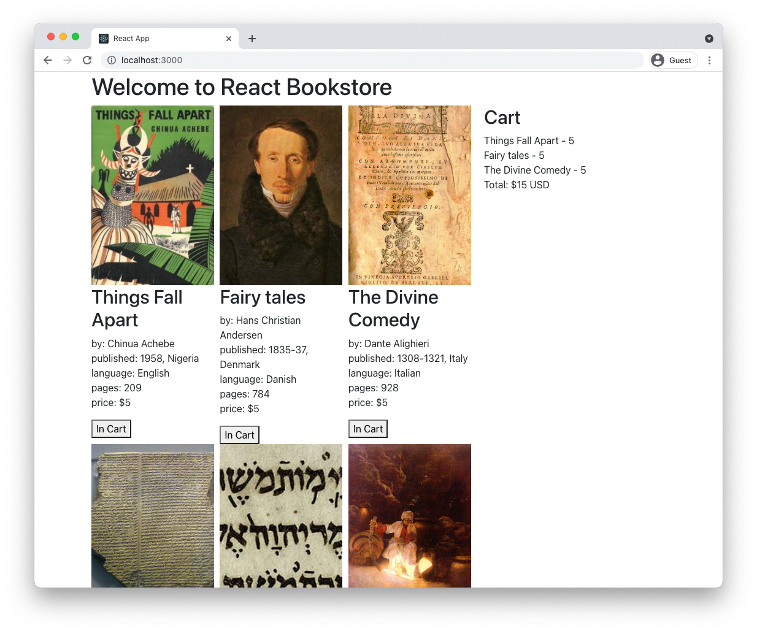

# Lab 15: Testing with React Testing Library

In this lab, you'll use Vitest and React Testing Library to write more tests for your components.

## Instructions

1. Create a new directory outside of src and name it tests. Create a new file named setup.ts in tests with the following content:

```typescript
import '@testing-library/jest-dom/vitest';
import { cleanup } from '@testing-library/react';
import { expect, afterEach } from 'vitest';

afterEach(() => {
  cleanup();
});
```

2. Create a file named vitest.config.ts at the root of your project, with the following content:

```typescript
import { defineConfig } from 'vitest/config';
import react from '@vitejs/plugin-react';
import tsconfigPaths from 'vite-tsconfig-paths';

export default defineConfig({
  plugins: [react(), tsconfigPaths()],
  test: {
    globals: true,
    environment: 'jsdom',
    setupFiles: './tests/setup.ts',
    coverage: {
      enabled: true,
      include: ['src/**/*.{js,jsx,ts,tsx}'],
      exclude: ['src/generated/**/*.ts'],
      reporter: ['text', 'html'],
    },
  },
});
```

3. Install some dependencies.

```bash
npm install --save-dev @vitejs/plugin-react
npm install --save-dev @vitest/ui
npm install --save-dev vite-tsconfig-paths
```

4. Modify your test script in package.json:

```json
"test": "vitest --ui",
```

5. Run `npm test` in the root of your project. The results will appear in the terminal and the vitest ui will open in a browser window.

You probably already have some basic tests that you created in previous labs. However, because of changes to the components you're testing, your tests may not all pass.

6. Update your existing tests so they all pass. You may need to use different methods from React Testing Library. Reference the testing library cheatsheet at the following URL to find additional queries to use:

https://testing-library.com/docs/react-testing-library/cheatsheet

7. When all your tests pass, you'll see a coverage report in the terminal, and you can access a coverage report in Vitest UI.

The Vitest UI should display your test results and coverage information:



8. Write more tests, refine your existing tests, and increase your test coverage %. See the solution for more ideas of tests to write and how to write them.
